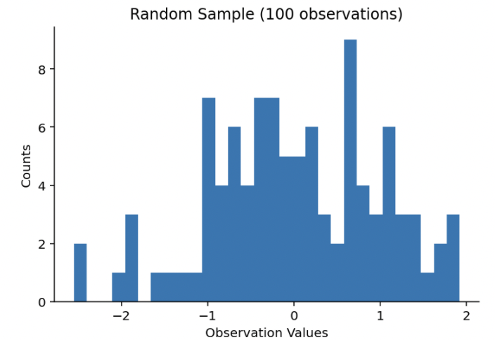
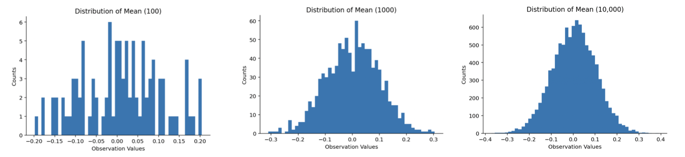
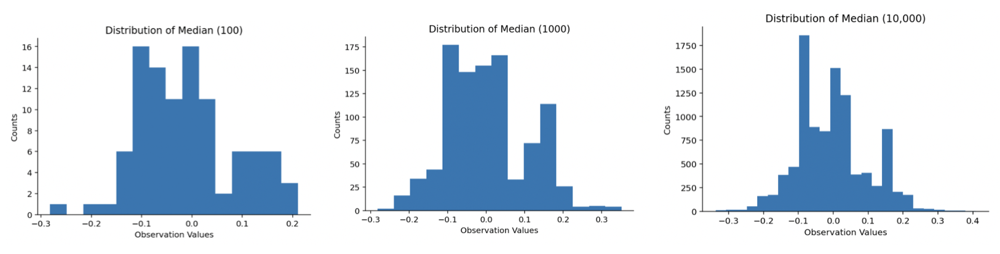

# Bootstrapping

As data scientists and, by extension, statisticians, our job is to perform tests and create models about a *target population* from data collected on a *sample* of that population. 

Let's say we want to find out the percentage of people in the world who like mint ice cream. We can survey a group of people of maybe 100 people to find out that 89% are mint ice cream enjoyers. Concluding that 89% of all 7 billion people on Earth enjoy mint ice cream is not good practice. However, continuing to survey people until all 7 billion opinions have been recorded is close to impossible, incredibly time-consuming, and expensive. This is where **bootstrapping**  comes in as a solution to our problem. 

## A quick introduction

**Bootstrapping** is a traditional statistics technique used to solve the problem of inadequate data. The idea is to generate a bootstrapped sample of the original data many, many times to imitate the generation of new data. 

> The term **bootstrapping** comes from the American idiom *"to pull oneself up by the bootstraps"*, which means to do something by your own efforts and resources, without outside help. 

In the same way, bootstrapping is a useful technique in statistics and data science, because it does not require time-consuming (and often, expensive) recollection of data, or repeated surveys. 

## Methodology
To bootstrap, we perform the following steps: 

1. Resample the existing data uniformly, and with replacement, for the total number of observations in the dataset.
2. Calculate a statistic (e.g. mean, median) for that bootstrapped sample. 
3. Record the result.
4. Repeat steps 1-3 many times. Often, bootstrapping can occur 1,000 - 100,000 times.

*([this StatQuest video](https://www.youtube.com/watch?v=Xz0x-8-cgaQ&ab_channel=StatQuestwithJoshStarmer) is helpful for both its visualizations and explanations)*

**Note:** Each bootstrapped dataset preserves the distribution of the original dataset. This follows from sampling uniformly and with replacement.

After performing the above steps to our satisfaction, we can reexamine the aggregate of our recorded statistics. The amount of data gathered should be adequate for us to understand the true population statistic. That is, if our initial sample set of data is an accurate reflection of the population, our result should return a true population mean, median, etc.

## Applications

Bootstrapping is an incredibly versatile tool for improving statistical inference. Next, we discuss three example applications. 

For the first two applications, we begin with a sample of 100 observations randomly selected from a range from 1 to 100. 

### 1. Means

For the bootstrapped means, we follow the steps in our methodology above. We calculate the mean for each bootstrapped sample, and plot them in a histogram. We repeated this 100, 1,000, and 10,000 times. As we can see below, the histograms become smoother as we repeat our process many times. The resulting final histogram with 10,000 replications is a perfect bell-curve, similar to that of a Gaussian distribution.

This is what we expect to see. Following [Central Limit Theorem](https://en.wikipedia.org/wiki/Central_limit_theorem), the distribution of many sample means will tend towards a normal distribution curve. In this way, we may be able to observe the true population mean, using just our sample data.

### 2. Medians

Just as we did for the means, we follow the steps in our methodology, except with sample medians. 

Unlike the bootstrapped sample means, however, there is no pretty distribution. Since there is no set theorem used to estimate the true population median, we do not observe a pretty bell-curve. Yet, this is a particularly useful application of bootstrapping. We can use bootstrapping to learn more about the distributions of statistics that do not have pre-established theorems like CLT. 

### 3. Decision trees and random forests

The third and final application of bootstrapping is used in data science classification problems. Here, bootstrapping is used to do [*bootstrap aggregating*](https://machinelearningmastery.com/essence-of-bootstrap-aggregation-ensembles/) or *bagging*. The idea is to create many bootstrapped samples (or *bags*) of the original data, train a decision tree model on each sample, and aggregate them into a final random forest model. 

*image credit: Bagging vs. Boosting in Machine Learning; GeeksforGeeks* 

To read more about applications of bootstrapping, as well as different types, such as non-parametric, Bayesian, etc. bootstrapping, check out [Jillian Green's Medium article](https://jillian-green.medium.com/applications-of-bootstrapping-8240da9df6d7))

## Summary
**Bootstrapping** is a statistical technique in which we replicate an existing dataset by resampling uniformly with replacement many times. The resulting bootstrapped samples and their corresponding statistic can then be accumulated into a final dataset that gives us important information about the overall target population. Since it is performed with minimal time, financial, and computational resources, which makes it a powerful tool in statistics and data science fields.

## More resources
* [StatQuest - *Bootstrapping Main Ideas!!!*](https://www.youtube.com/watch?v=Xz0x-8-cgaQ&ab_channel=StatQuestwithJoshStarmer)
* [Jim Frost/Statistics By Jim - *Introduction to Bootstrapping in Statistics*](https://statisticsbyjim.com/hypothesis-testing/bootstrapping/)
* [Trist'n Joseph - *Bootstrapping Statistics*](https://towardsdatascience.com/bootstrapping-statistics-what-it-is-and-why-its-used-e2fa29577307)
* [Jillian Green - *Applications of Bootstrapping*](https://jillian-green.medium.com/applications-of-bootstrapping-8240da9df6d7)
* [Jason Brownlee - *Essence of Bootstrap Aggregation*](https://machinelearningmastery.com/essence-of-bootstrap-aggregation-ensembles/)

